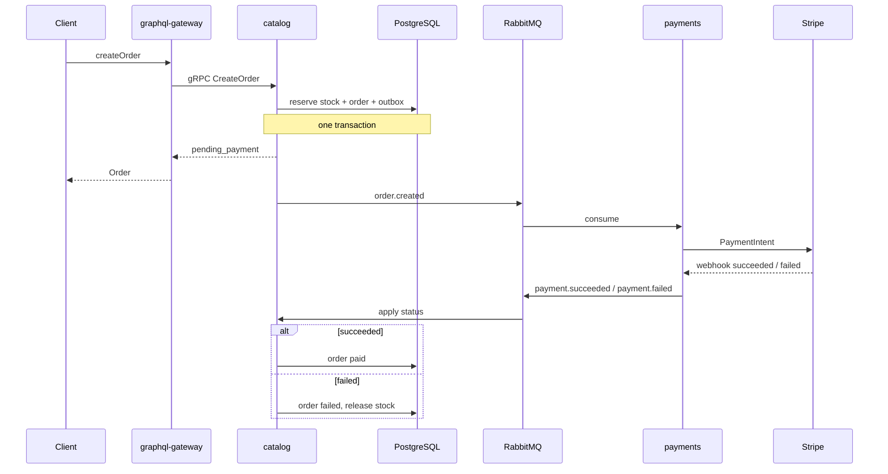

# Arcade Vault

Domain API for an arcade cabinet shop: unique machines, atomic stock, orders, and Stripe sandbox payments.

Go services with Clean Architecture, gRPC internally, GraphQL at the edge, PostgreSQL via sqlc/pgx, RabbitMQ, and OpenTelemetry → Jaeger. Built as a portfolio system, not a generic CRUD store.

**Status:** Phase 0 foundation — local stack, catalog gRPC health, traces, CI. Domain work lands in later [phases](docs/ROADMAP.md).

## Why this exists

Selling a cabinet is a race on a single unit of stock, plus a payment that may fail and must release that unit. That is enough domain to justify:

- explicit SQL for reservations (sqlc + pgx, not an ORM)
- a transactional outbox instead of publish-then-commit
- traces that cross GraphQL → gRPC → Postgres → RabbitMQ → Stripe

## Architecture

```
┌─────────────────────────────────┐
│        graphql-gateway          │
│      public GraphQL (gqlgen)    │
└──────────────┬──────────────────┘
               │ gRPC
     ┌─────────┴─────────┐
     ▼                   ▼
┌──────────────┐   ┌──────────────┐
│   catalog    │   │   payments   │
│ cabinets     │   │ Stripe       │
│ stock, orders│   │ webhooks     │
└──────┬───────┘   └──────┬───────┘
       └──── RabbitMQ ────┘
              PostgreSQL · Jaeger · slog
```

| Process | Role |
|---|---|
| **graphql-gateway** | Public BFF. No database, no business rules. |
| **catalog** | Cabinets, stock reservations, orders, outbox. |
| **payments** | Stripe PaymentIntents, idempotent webhooks. |

Two bounded contexts on purpose. GraphQL lives only on the gateway. Postgres is one cluster with a schema per service.

[Architecture](docs/ARCHITECTURE.md) covers layers, outbox, idempotency, and error mapping. [Roadmap](docs/ROADMAP.md) is the phase-by-phase build.

## Checkout



Stock is taken when the order is created, not when Stripe confirms. Failure must roll availability back. Duplicate webhooks are no-ops.

## Stack

| Layer | Choice | Why |
|---|---|---|
| Public API | GraphQL (gqlgen) | One schema for demos and clients |
| Internal API | gRPC + Protobuf | Typed contracts between services |
| Database | PostgreSQL 16, sqlc, pgx/v5 | The reservation *is* the SQL |
| Migrations | golang-migrate | Explicit schema, no AutoMigrate |
| Events | RabbitMQ | `order.created` / `payment.succeeded` / `payment.failed` |
| Payments | Stripe test mode | Real webhook verification, sandbox cards |
| Logs | `log/slog` JSON | `trace_id` on every line |
| Tracing | OpenTelemetry → Jaeger | One span tree for checkout |
| Tests | testcontainers | Race on the last cabinet against real Postgres |
| Local / CI | Docker Compose, GitHub Actions | Clone, up, test |

**Not in v1:** Kubernetes, Redis, Kafka, OAuth, GORM, a product frontend. GraphiQL is the UI.

Auth is an `X-User-Id` header forwarded as gRPC metadata — enough to attribute orders, not a production identity story.

## Repository layout (target)

```
cmd/catalog            cmd/payments           cmd/gateway
internal/<service>/{domain,app,adapter}
api/proto              api/graphql
db/catalog             db/payments
deploy/compose
```

`domain` packages do not import infrastructure.

## Running locally

```bash
cp .env.example .env   # optional; defaults match Compose
make compose-up        # Postgres, RabbitMQ, Jaeger + catalog migrations
make run-catalog       # migrates (if needed), seeds, gRPC on :50051
make test
```

`make compose-up` applies `db/catalog/migrations` after Postgres is healthy. `make run-catalog` runs the same migrations again (no-op if already applied) and then seeds cabinets. Re-run migrations later with `make migrate`.

| Surface | URL |
|---|---|
| Catalog gRPC | `localhost:50051` |
| Jaeger UI | `http://localhost:16686` |
| RabbitMQ UI | `http://localhost:15672` |
| GraphiQL | later, with the gateway |

**See a trace:** with Compose and catalog running, `grpcurl` a `ReserveStock` (or Health/Check). In Jaeger, search service `catalog`. `ReserveStock` should show a child span named `ReserveCabinet`. Checkout traces (gateway → payments → Stripe) arrive in later phases.

**Stripe (from Phase 4):** `make compose-up` does not start stripe-cli (`profiles: [stripe]`). Test card `4242 4242 4242 4242` for success; `4000 0000 0000 9995` for failure. Never commit secrets.

## Tests that matter

Coverage percentage is not the point. These four are:

1. Two goroutines reserve the last cabinet — one wins.
2. `CreateOrder` writes stock, order, and outbox in one transaction.
3. A duplicate Stripe webhook does not apply twice.
4. A failed payment releases stock.

## Docs

- [Architecture](docs/ARCHITECTURE.md) — boundaries, Clean Architecture, data, messaging, observability
- [Roadmap](docs/ROADMAP.md) — phases, definition of done, what not to build

## License

[MIT](LICENSE)
